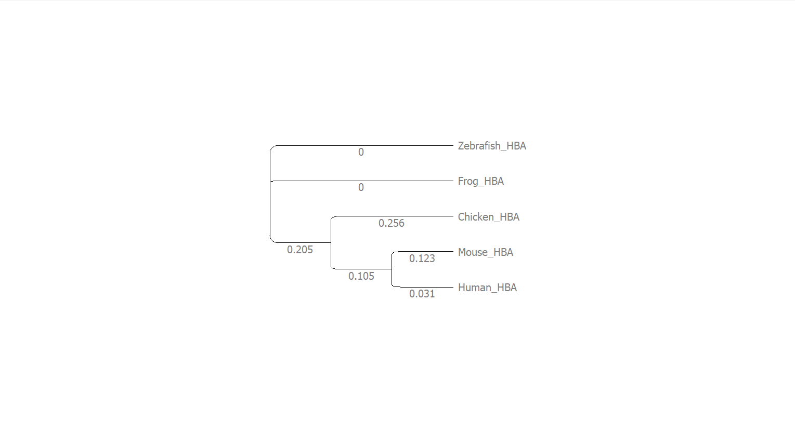

# Phylogenetic Analysis of Hemoglobin Proteins

## Project Overview
Phylogenetic analysis of hemoglobin alpha chain proteins from five vertebrate species using UGENE with Clustal Omega for alignment and Maximum Likelihood for tree construction.

## Species Analyzed
- **Human** (*Homo sapiens*)
- **Mouse** (*Mus musculus*) 
- **Chicken** (*Gallus gallus*)
- **Zebrafish** (*Danio rerio*)
- **Frog** (*Xenopus tropicalis*)

## Key Findings
- **Evolutionary relationships** consistent with established phylogeny
- **Mammals cluster together** (Human + Mouse)
- **High conservation** of oxygen-binding domains
- **Branch lengths** indicate evolutionary divergence times

## 🛠Methodology
1. **Sequence retrieval** from NCBI Protein database
2. **Multiple sequence alignment** using Clustal Omega in UGENE
3. **Phylogenetic tree construction** with Maximum Likelihood method
4. **Tree visualization** and evolutionary analysis

## Files
- `hemoglobin_sequences.fasta` - Input sequences in FASTA format
- `alignment.clustal` - Multiple sequence alignment results  
- `phylogenetic_tree.png` - Visualized evolutionary tree

## Phylogenetic Tree

**Tree Interpretation**:
- Mammals (Human/Mouse) form a clade as expected
- Chicken represents the avian lineage
- Zebrafish and Frog show more distant relationships
- Branch lengths proportional to evolutionary distance

## Bioinformatics Tools
- **UGENE** - Integrated bioinformatics platform
- **Clustal Omega** - Multiple sequence alignment
- **Maximum Likelihood** - Phylogenetic tree construction
- **NCBI Protein** - Sequence database

## Skills Demonstrated
- Phylogenetic analysis pipeline
- Multiple sequence alignment
- Evolutionary biology concepts
- Professional bioinformatics software
- Scientific documentation

